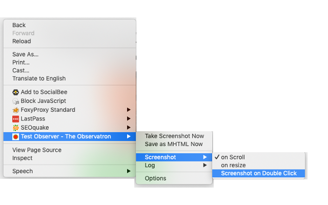
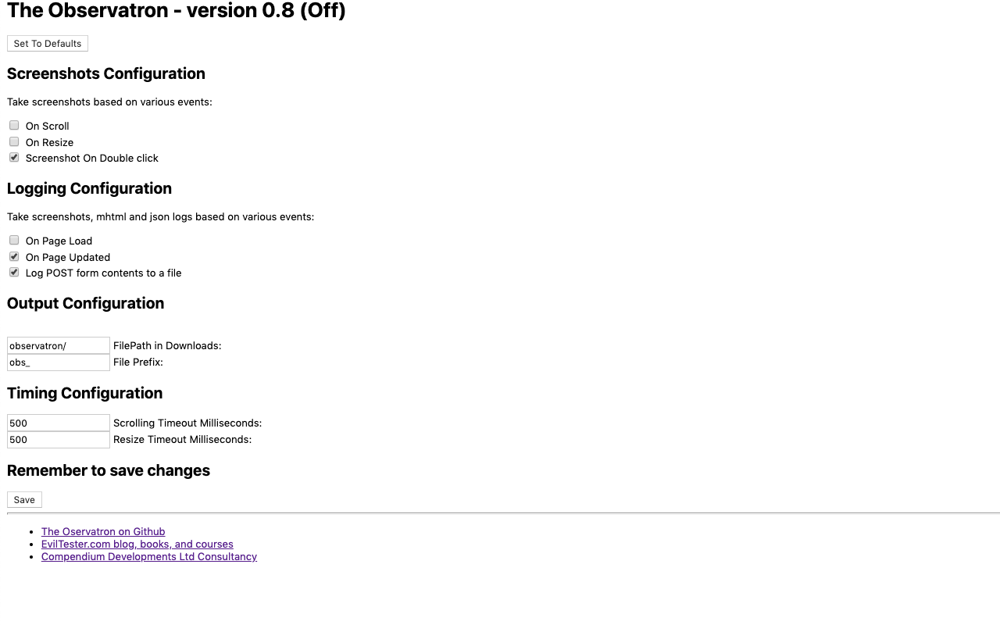

# Observatron

A prototype exploratory testing observation tool for Chrome browser. Designed to allow
people who are performing Exploratory Testing on a Web App to:

- track notes
- take screenshots
- log events

These are saved in a folder for future analysis e.g. by other tools, or by AI Coding Agents with
file access.

You can download this from the Chrome Store:

- [The Observatron Chrome Store Page](https://chrome.google.com/webstore/detail/test-observer-the-observa/gdiemnbjpblghfbejnbohdnnmodbknoe)

To self-install from source:

- download the files from [releases](https://github.com/eviltester/observatron/releases)
- visit [chrome://extensions](chrome://extensions)
- switch on Developer mode
- Load unpacked
- choose the 'chrome' folder (the one with the manifest in it)

## Automated Observation

To use:

- Click the red button [Engage the Observatron] to start automated observing
- the button will turn green
- Click the green button [Disengage the observatron] to finish automated observing

Only the domain you engage observatron will have automated events logged, manual logs can be created from the notes view on any page.

As you browse and test, you will see files download based on the configured options.

These will be in a `\observatron` folder in your downloads folder.

You will see screenshots and .mhtml files.

- screenshots are taken when you load a page, and when you scroll
- `.mhtml` files are extracted when you load a page

`.mhtml` files can be opened in a browser and are the packaged css, and html of the page at the time.

screenshots are what was shown on the screen.

If you right click on the icon and choose options then you can configure the extension.

- [ ] On Scroll (take a screenshot when you finish scrolling)
- [ ] On Resize (take a screenshot after you resize the browser window)
- [ ] On Page Load (take a screenshot and save an mhtml when the page loads)
- [ ] On Page Updated (take a screenshot and save an mhtml when the page updates)
- [ ] Screenshot On Double click (take a screenshot when you double click on the page)
- [ ] Log POST form contents to a file (should log form Posts to a json file - off by default) 

You can also configure the folder (within dowloads to save the files e.g. change it to match the feature you are testing). Also the file prefix. And the timeouts the system uses for checking if you are still scrolling or still resizing.

## Double Click Screenshots

If the observatron is engaged and you have configured "Double Click Screenshots" then you can take a screenshot by double clicking on the page.

## Instant Functions

Some functionality is available regardless of the engaged state of the observatron.

You can always use the context menu to:

- Take Screenshot Now
- Save as MHTML Now
- Take Note

"Take Note" is also mapped to a key, by default this is "Ctrl+Shift+L" or "Cmd+Shift+L" on Mac

You can configure key mappings using [chrome://extensions/configureCommands](chrome://extensions/configureCommands)

## Taking Notes

Initiate a note taking using the separate web page by:
- using the context menu
- the keyboard short cut

Or "Show Side Panel" to show the side panel with note taking functionality.

Or use the Observatron panel in the dev tools.

When faced with the dialog:

> Add Note to log 
> (? question, ! bug, - todo, @customtype)

You can type in text and it will be logged to a json file in your download folder.

By default it will be saved as type "note".

If you prefix the text with "?" then it will be saved as a question e.g. "? should the system do this?"

e.g. Saved as "obs_2019-02-20-11-32-57-208-question_1550662375417.json"

~~~~~~~~
{"type":"question","text":"should the system do this?","id":"1550662375417"}
~~~~~~~~

After typing a note you will see a prompt "Do you want a screenshot with that?". Choosing [OK] will save a screenshot, choosing [Cancel] will not.

Type of notes are:

- "?" `question`
- "!" `bug`
- "-" `todo`
- "@anythingyouwant" where "anythingyouwant" is the type you want

When you save a screenshot it will have `_note_noteid` at the end of the filename.

e.g. "obs_2019-02-20-11-32-57-314-screenshot-1201x1104_note_1550662375417.jpg"

This can help you cross-reference screenshots to notes, although the timestamping should mean that the screenshot is the next file saved after the note.

## Keyboard Shortcuts

To create a note:

- "default": "Ctrl+Shift+L",
- "mac": "Command+Shift+L"

---

## Context Menu

The context menu provides access to instant screenshot or .mhtml saving, and allows you to toggle on and off the checkbox options.

(You still need to use the options screen to change output paths and timings)

---

## Options Screen

The options screen, right click from context menu or manage from `chrome://extensions`

---

Copyright 2019-2025 Compendium Developments Ltd, Alan Richardson

https://eviltester.com
https://compendiumdev.co.uk

---

## Detailed Description

The Observatron supports Exploratory testing by taking screenshots and creating .mhtml files as you test. It also logs urls and form submissions. All logging is performed in your downloads folder so that you have control over the information. No information is sent to external servers.

Logging and screenshots saved when:

- when a page loads
- when a page updates
- when you double click on the page
- when you resize the page
- when you scroll through the page
- when you submit a form

All of the above can be switched on and off from the options.

All images are stored in your downloads folder so you can easily find them and see them being saved.

You can also save logs of: bugs, todos, questions, or any custom information. To do this:

- from the context menu choose "Take Note"
- in the dialog, write your note
- you will be asked if you want a screenshot with that
- the note and optional screenshot will be saved to your downloads

Notes take the format:

- "? question text to output as the note"
- "! description of the bug to output as the note"
- "- todo text to output"
- "@type text to output as custom type"

When you save a screenshot with the note screenshot it will have `_note_noteid` at the end of the filename. This can help you cross reference screenshots to notes, although the timestamping should mean that the screenshot is the next file saved after the note.

e.g. "obs_2019-02-20-11-32-57-314-screenshot-1201x1104_note_1550662375417.jpg"

This extension is open source.

Copyright 2019-2025 Compendium Developments Ltd, Alan Richardson

---

## Capabilities, ToDos

### Does not:

- capture keypresses
    - it captures 'input' events
    - i.e. changing checkbox, input field, etc.
- log alert creation, display or interaction
- capture http traffic - suggest using a proxy which exports HAR files e.g. Zap Proxy
    - does capture form posts as post events

### Does:

- only automatically capture events for the domain on which it was enabled
- capture mutation events
    - e.g. text changing
    - buttons added
- save screenshots of visible screen area
    - on resize
    - on scroll
    - on double click
- save screenshots of selected element
    - use the sidebar view, select element, create a note with 'include element screenshot'
- capture form post events (when configured)
- save manual notes
show notes in side-bar
    - sequential based on time stamp
    - by type and status (open, closed)
        - question
        - bug
        - todo
        - custom
- save notes button
    - requires - tracking internally, not just event logging
- show options in sidebar to make easier to maintain
- add status to special note type (open, closed) (question, bug, etc.)
    - track status, open closed as event log
- session id configurable in options to create configurable subfolder (below date)
- option to - flatten folders into filename e.g. observatron/2025_12_27_sessionid
    - make flatten option the default
- limit the custom note type name length (15 chars)
- @custom[] (would allow opening and closing because it is a custom with a state - state == [])

### TODO:

- configurable data sizes (mutation text, clicked target text)
- resize log with screensize change, not just screenshot
- mouse events - move
- scan page for broken links when a page is opened (store what url was scanned and only scan once).
- configurable auto save notes to file every (X minutes, after every note, config)

---

# Versions

- 0.98 session improvements
  - session id editable and used for folder name
  - flatten folder into single sub folder rather than nested e.g. 2025/12/27/session vs 2025-12-27-session (flat is default)
  - limit custom name length
  - allow custom types to be closed when created with `@name[]`
- 0.97 options and notes (released 20251227)
   - add the options to the notes screen for easier access
     - still available as Manage Extension options
   - improve note-taking
     - added note tracking in memory
     - save to disk as text report
     - save/load to disk from json
     - open/close questions, todos, bugs for local session tracking
     - filter notes in memory e.g. see open todos
- 0.96 more events and sidebar
   - notes:
     - removed notes input box and added page and sidebar and dev tools extension
     - add notes screen shows when adhoc "take note" used from context menu
     - sidebar can be shown from context menu - useful when you want to see which element you are screenshotting
     - devtools tab - useful when you want to do more manual note tracking for general testing
   - enabled domain
     - automated event generation and screenshots is only enabled for the domain that you start the observatron on
     - manual events can be created using notes for any domain without switching on the observatron
  - element screenshots
    - when creating a note, can select an element in the dev tools element view and output a screenshot of 'just the element' with the note.
    - required adding scripting permission
  - more event capture
    - mutation
    - click
    - input
- 0.95 updated to manifest v3 and added much more error handling - 20251222
- 0.92 initial version

