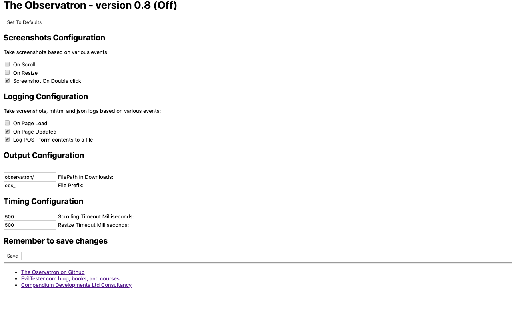

# Observatron

Observatron is a Chrome extension for gathering evidence while you explore and test web applications. It can take screenshots, save MHTML page snapshots, log browser events, and organise notes, bugs, questions, and todos.

The side panel has page checks for broken links, broken images, HTML comments, and accessibility. Traffic Monitor searches HTTP request and response bodies, Network Errors collects failed requests, and Console Monitor collects console messages and JavaScript errors. You can add findings to your notes alongside your other session evidence.

You can download this from the Chrome Store:

- [The Observatron Chrome Store Page](https://chrome.google.com/webstore/detail/test-observer-the-observa/gdiemnbjpblghfbejnbohdnnmodbknoe)

### Install from a GitHub release

1. Download `observatron-v-<version>.zip` from **Assets** on the [releases page](https://github.com/eviltester/observatron/releases) and extract it.
2. Open `chrome://extensions` in Chrome and turn on **Developer mode**.
3. Click **Load unpacked** and select the extracted folder containing `manifest.json`.

If you cloned this repository, select the `chrome` folder to load the extension directly.

## Automated Observation

To use:

- Click the red button [Engage the Observatron] to start automated observing
- the button will turn green
- Click the green button [Disengage the observatron] to finish automated observing

Only the domain you engage observatron will have automated events logged, manual logs can be created from the notes view on any page.

Right-click the toolbar icon to open **Show Side Panel**, find the **Tools** submenu, or choose **Start Observing** or **Stop Observing**. The same observation controls sit above the sidebar tabs, with a green indicator while observing and a red one when stopped. Chrome displays the split red-and-green extension icon beside the panel title. Stopping keeps the side panel open.

As you browse and test, you will see files download based on the configured options.

These will be in a `\observatron` folder in your downloads folder.

You will see screenshots and .mhtml files.

- screenshots are taken when you load a page, and when you scroll
- `.mhtml` files are extracted when you load a page

`.mhtml` files can be opened in a browser and are the packaged css, and html of the page at the time.

screenshots are what was shown on the screen.

If you right click on the icon and choose options then you can configure the extension.

- [ ] On Scroll (take a screenshot when you finish scrolling)
- [ ] On Resize (take a screenshot after you resize the browser window)
- [ ] On Page Load (take a screenshot and save an mhtml when the page loads)
- [ ] On Page Updated (take a screenshot and save an mhtml when the page updates)
- [ ] Screenshot On Double click (take a screenshot when you double click on the page)
- [ ] Log POST form contents to a file (should log form Posts to a json file - off by default) 

You can also configure the folder (within dowloads to save the files e.g. change it to match the feature you are testing). Also the file prefix. And the timeouts the system uses for checking if you are still scrolling or still resizing.

## Double Click Screenshots

If the observatron is engaged and you have configured "Double Click Screenshots" then you can take a screenshot by double clicking on the page.

## Instant Functions

Some functionality is available regardless of the engaged state of the observatron.

The context menu's **Tools** submenu has these actions:

- **Take Screenshot Now**
- **Save as MHTML Now**
- **Take Note**
- **Save Comments**

"Take Note" is also mapped to a key, by default this is "Ctrl+Shift+L" or "Cmd+Shift+L" on Mac

You can configure key mappings using [chrome://extensions/configureCommands](chrome://extensions/configureCommands)

## Taking Notes

Initiate a note taking using the separate web page by:
- using the context menu
- the keyboard short cut

Or "Show Side Panel" to show the side panel with note taking functionality.

Or use the Observatron panel in the dev tools.

When faced with the dialog:

> Add Note to log 
> (? question, ! bug, - todo, @customtype)

You can type in text and it will be logged to a json file in your download folder.

By default it will be saved as type "note".

If you prefix the text with "?" then it will be saved as a question e.g. "? should the system do this?"

e.g. Saved as "obs_2019-02-20-11-32-57-208-question_1550662375417.json"

~~~~~~~~
{"type":"question","text":"should the system do this?","id":"1550662375417"}
~~~~~~~~

Choose **Include screenshot** to capture the visible page with the note, or **Include element screenshot** to attach a crop. Then click **Save Note**.

Type of notes are:

- "?" `question`
- "!" `bug`
- "-" `todo`
- "@anythingyouwant" where "anythingyouwant" is the type you want

In **Notes Collection**, use **Change Type** on an open note to choose a built-in or custom type. Types that support opening and closing keep the note open. A custom type ending in `[]` supports both statuses.

When saving a note with **Include element screenshot**, choose the last clicked element or the selection in DevTools. The note links to the cropped image when capture succeeds. If a screenshot fails, Observatron saves the note and shows the reason below **Save Note**.

When you save a screenshot it will have `_note_noteid` at the end of the filename.

e.g. "obs_2019-02-20-11-32-57-314-screenshot-1201x1104_note_1550662375417.jpg"

This can help you cross-reference screenshots to notes, although the timestamping should mean that the screenshot is the next file saved after the note.

## Page Checks

Open the Observatron side panel or the **Test Observatron** panel in Chrome DevTools.

Expand **Monitors** on the **Observatron** page to see the **Axe**, **HTML Comments**, **Links**, **Images**, **Traffic**, **Network Errors**, and **Console** subtabs. The section starts collapsed. Its heading lists each monitor, its count when it has results, and a spinner while a review runs. The dedicated **Monitors** tab opens directly to the same subtabs and shows their combined total. The counts change colour when new results arrive.

The URL below the tabs shows which page Observatron is targeting. Hover over it to see the full address. The copy button copies the full URL, and **Create Note** adds it to the note draft. The sidebar follows the active browser tab. The DevTools panel stays with the tab it is inspecting.

Under **Add Element Note**, **Active in page** becomes available after you click an element that is still on the target page. **Selected in Dev Tools** is available while DevTools is open for that tab and uses the selection from **DevTools → Elements**. Both actions include the source URL in your draft. **Take Element Screenshot** also has a **By CSS Selector** option for selectors that match one element in the main document. Warnings appear below the action and clear after 15 seconds or when you click **×**.

- Select **Links** or **Images** and run the check to see failed URLs and their HTTP results. Use **Add to Note Draft** on any finding you want to record or **Clear Results** to empty the review. Both checks can also run during automated observation when enabled in Options.
- Select **HTML Comments** and click **Scan For HTML Comments** to see the comments on the page. **Add to Note Draft** copies an individual comment to your draft, and **Save to Markdown** exports the full scan. **Clear Results** clears the review.
- Select **Axe** and click **Check Accessibility** to run axe-core on the current page's main document. The heading shows the number of confirmed issues. Expand a finding to see its affected elements. **Needs Manual Review** lists checks axe could not decide, with the rule ID, guidance, and elements to inspect. **Show on Page** scrolls to an element and outlines it for five seconds. **Take Screenshot** crops the element from the scan while it is still on the page, including for a page-load report. **Show HTML** displays the captured snippet. **Add to Note Draft** appends the finding, and **Clear Results** clears the review while preserving your draft.
- Select **Axe → Check Responsive Accessibility** to run axe-core at 360, 768, and 1280 CSS pixels wide. The check temporarily resizes the current tab's viewport and restores it when the scan finishes. The report groups confirmed issues and manual checks by width. Expand a finding to see its selector and HTML, or add it to a note draft with the viewport width.

In **Options → Event Logging**, enable a page-load review for HTML comments, accessibility, broken links, or broken images to check pages as you browse an observed domain. Each defaults to populating its review section. A spinner appears on the review tab while the check runs, including in AutoNotes mode. Select **AutoNotes** to save findings automatically.

## Traffic Monitor

Traffic Monitor brings the request and response text checks from [CDP Test Support](https://github.com/eviltester/cdptestsupport) into Observatron. Use it to find unexpected destinations for synthetic test data or to catch server messages you did not see in the UI.

Turn on **Traffic Monitoring** in **Options → Event Logging** to start the monitor for the panel's target tab using the saved rules. Its button reads **Monitoring On - configure via options**. Switch the option off to stop automatic monitoring and use the manual controls.

1. Open the Observatron side panel, or select **Test Observatron** in Chrome DevTools. Both panels show the same report for the monitored tab.
2. Select **Traffic** and add temporary rules under **Session-only rules**, one rule per line. **Use saved rules from Options** is checked by default. Uncheck it to run only the session rules.
3. Click **Start Monitoring**, then exercise the feature. The monitor checks completed HTTP and HTTPS requests from that tab, including requests to other domains. The Traffic tab shows the match count and changes colour as matches arrive.
4. Tick the matches whose rules you want to reuse and click **Save Selected Rules to Options**. Manage these rules under **Options → Saved Traffic Rules**, where you can also add rules directly. Manual runs load saved rules when you click **Start Monitoring**. Automatic runs pick up changes as you save them.
5. Expand **Match details** to see the request URL, including query parameters, and a short excerpt highlighting the first occurrence in the request or response body. **Add to Note Draft** records the resource path and match location. **Clear Matches** empties the list, and **Stop Monitoring** ends the run.

Use the same rule syntax in Traffic Monitor and **Options → Saved Traffic Rules**.

```text
Checkout email = qa+checkout@example.test
Padded value = " padded value   "
Quoted value = ""ok""
Whole word * \btodo\b
```

`=` finds a case-sensitive literal substring. Double quotes around the value preserve every character inside them, including spaces and inner quotes. `Quoted value = ""ok""` matches `"ok"` with the quotes. `*` takes a JavaScript regular expression with whitespace on both sides of the separator. Enter the pattern directly, without slash delimiters. A whole-word regex such as `\btodo\b` matches `todo` as a word.

Matching covers request bodies and text response bodies that Chrome makes available after a request completes. Headers, URL parameters, binary data, and WebSocket messages are outside its scope. Start before exercising the page so the monitor can see the traffic you want to check.

The monitor reports the rule name, request or response, HTTP method, resource URL, and time. Note drafts include the URL through the resource path and the line and column of the first match. Query parameters and body excerpts are available in the report. Saving a rule writes its name and exact search text to this browser profile. Use synthetic values as markers.

## Network Errors

Select **Network Errors** and click **Start Monitoring** to collect HTTP 4xx and 5xx responses and failed network requests independently of any Traffic rules. Expand an error for the request URL, HTTP method, page or frame URL, resource type, error, and time. Use **Add to Note Draft** to keep an error or **Clear Results** to empty the report.

In **Options → Event Logging**, turn on **Network Errors** to start it automatically for the panel's target tab. **Log as Network Errors Report** is the default. Select **Log network errors as AutoNotes** to save each new error to the Notes Collection as it occurs.

## Console Monitor

Select **Console** and click **Start Monitoring** to collect page console messages and uncaught JavaScript errors as you test. Expand an entry for its full message, location, and stack trace when available. Click **Add to Note Draft** to keep an entry, or **Clear Results** to empty the review. Turn on **Console Logging** in **Options → Event Logging** to start it automatically for the panel's target tab.

Traffic, Network Errors, and Console have separate controls and share one debugger connection per tab. Chrome shows its debugging banner while the debugger is attached. Stopping all monitors releases the connection. Each report keeps the latest 100 results for that tab. Capture continues when you switch tabs or close the panel, and closing the monitored tab discards its temporary rules and reports. The monitors' start and stop controls are separate from automated observation.

## Keyboard Shortcuts

To create a note:

- "default": "Ctrl+Shift+L",
- "mac": "Command+Shift+L"


---

## Context Menu

Right-click the Observatron toolbar icon. **Show Side Panel** comes first, followed by a separator and **Tools**. **Start Observing**, **Stop Observing**, and **Options** are also on this menu. Use **Options** to configure event logging, output paths, and timings.

---

## Options Screen

The sidebar's **Options** tab saves settings when you switch to another tab. On the standalone Options page, opened from the extension menu or `chrome://extensions`, click **Save** to apply changes.




---

Copyright 2019-2025 Compendium Developments Ltd, Alan Richardson


https://eviltester.com
https://compendiumdev.co.uk


---

## Detailed Description

The Observatron supports Exploratory testing by taking screenshots and creating .mhtml files as you test. It also logs urls and form submissions. All logging is performed in your downloads folder so that you have control over the information. No information is sent to external servers.

Logging and screenshots saved when:

- when a page loads
- when a page updates
- when you double click on the page
- when you resize the page
- when you scroll through the page
- when you submit a form

All of the above can be switched on and off from the options.

All images are stored in your downloads folder so you can easily find them and see them being saved.

You can also save logs of: bugs, todos, questions, or any custom information. To do this:

- From the context menu, choose **Tools → Take Note**, or switch to **Notes** in the sidebar.
- Write your note and choose any screenshots to include.
- Click **Save Note** to save the note and its attachments to your downloads.

Notes take the format:

- "? question text to output as the note"
- "! description of the bug to output as the note"
- "- todo text to output"
- "@type text to output as custom type"

Screenshots saved with a note have `_note_<noteid>` at the end of the filename. The note records the paths to its saved screenshots.

e.g. "obs_2019-02-20-11-32-57-314-screenshot-1201x1104_note_1550662375417.jpg"

This extension is open source.

Copyright 2019-2025 Compendium Developments Ltd, Alan Richardson


---

## Capabilities, ToDos

### Does not:

- capture keypresses
    - it captures 'input' events
    - i.e. changing checkbox, input field, etc.
- log alert creation, display or interaction
- save a full HTTP traffic archive. Traffic Monitor reports matches from the inspected tab, and the separate POST option logs form submissions when enabled.
    - does capture form posts as post events

### Does:

- only automatically capture events for the domain on which it was enabled
- capture mutation events
    - e.g. text changing
    - buttons added
- save screenshots of visible screen area
    - on resize
    - on scroll
    - on double click
- save screenshots of selected element
    - use the sidebar view, select element, create a note with 'include element screenshot'
- capture form post events (when configured)
- save manual notes
show notes in side-bar
    - sequential based on time stamp
    - by type and status (open, closed)
        - question
        - bug
        - todo
        - custom
- save notes button
    - requires - tracking internally, not just event logging
- show options in sidebar to make easier to maintain
- add status to special note type (open, closed) (question, bug, etc.)
    - track status, open closed as event log
- session id configurable in options to create configurable subfolder (below date)
- option to - flatten folders into filename e.g. observatron/2025_12_27_sessionid
    - make flatten option the default
- limit the custom note type name length (15 chars)
- @custom[] (would allow opening and closing because it is a custom with a state - state == [])
- check for broken links in parallel to the user testing
- check for broken images in parallel to the user testing
- manual check for links or images is also done in parallel with user testing

### TODO:

- configurable data sizes (mutation text, clicked target text)
- resize log with screensize change, not just screenshot
- separate page load event i.e. track without saving screen details
- mouse events - move
- configurable auto save notes to file every (X minutes, after every note, config)
- possible custom user scripts before/after events - or just use TamperMonkey for that?
- report on the links that were checked during the session - list of URLS and their status - to show coverage
- check for links and images on mutation, not just page load, and scan if available (use manual scan for the moment)
- improve automated execution and condition coverage during build#
- allow saving a filtered list of notes e.g. all open items or any filter to a text, json file or clipboard e.g. easy end of session open tasks and bugs tracking
- when checking a link, if an error occurs, all the user sees is 'error' with no indication of what happened - improve this
- show a message when **Tools → Save Comments** finds no comments

### Build and Deploy

1. Update the version in `chrome/manifest.json` and `package.json`, then land the changes on `master`.
2. In GitHub, choose **Actions → Make Release → Run workflow** on `master`.
3. The workflow runs lint and tests, then publishes `v<version>` with generated release notes and `observatron-v-<version>.zip`.

`npm run build` creates the same ZIP locally under `release/`. Use that ZIP or download the release asset to submit it through the [Chrome Web Store developer dashboard](https://chrome.google.com/webstore/developer/dashboard).
  
---

# Versions

- 1.0.4
   - Added **Start Observing** and **Stop Observing** to the sidebar and toolbar menu. Put **Show Side Panel** first, grouped manual actions under **Tools**, and added the split red-and-green panel icon.
   - Added **Notes**, **Tools**, **Monitors**, and **Options** tabs. Sidebar Options save when you leave the tab. The sidebar opens at the top and shows a shortened page URL with copy and note actions for the full address.
   - Grouped Axe, HTML Comments, Links, Images, Traffic, Network Errors, and Console in the collapsible **Monitors** section and the dedicated **Monitors** tab. Added live counts, colour changes, and progress spinners.
   - Added sidebar traffic monitoring and console capture, with manual or automatic start, reviewable results, and actions to add findings to a draft. Traffic Monitor supports both saved rules and rules for the current session.
   - Added on-demand HTML comment, broken link, and broken image reports. Those checks and Axe can run on page load and show a report or save AutoNotes.
   - Added an independent **Network Errors** monitor with report and AutoNotes modes, and a **Responsive Accessibility** check that runs Axe at three viewport widths.
   - Added note and screenshot actions for the last clicked element or the DevTools selection. Element screenshots also support a CSS selector or the specific element from an Axe finding.
   - Added type changes for open notes. Notes save even when a screenshot fails, with a dismissible warning below the action.
- 1.0.3
   - Added Traffic Monitor to the DevTools panel. Search available HTTP request and response text for named strings, including traffic to third-party destinations. Add observations to your notes and save selected search rules in Options for reuse.
   - Show the rules and affected elements that need manual review in the Axe Accessibility Review.
- 1.0.2
   - Added a collapsible Axe Accessibility Review section for on-demand checks. Highlight affected elements on the page, expand their HTML snippets, add a finding to your note draft, or clear the results.
   - Fixed monitoring so the selected hostname is restored after the extension’s service worker restarts.
- 1.0.1
   - migrated html comment detection from Test Tool Hub
   - added more options to configure event checking
   - removed option setting from popup - need to use the options views now
   - background and manual trigger broken link check - based on link check in test tool hub
   - background and manual trigger broken image check
   - status rendering of background info - monitored domain (in image alt), and link and image checking queue length
- 1.0
  - added tests and build process
  - tidied logging
  - added event listeners only when enabled
- 0.99 bug fixes for enablement and element screenshots
- 0.98 session improvements
  - session id editable and used for folder name
  - flatten folder into single sub folder rather than nested e.g. 2025/12/27/session vs 2025-12-27-session (flat is default)
  - limit custom name length
  - allow custom types to be closed when created with `@name[]`
- 0.97 options and notes (released 20251227)
   - add the options to the notes screen for easier access
     - still available as Manage Extension options
   - improve note-taking
     - added note tracking in memory
     - save to disk as text report
     - save/load to disk from json
     - open/close questions, todos, bugs for local session tracking
     - filter notes in memory e.g. see open todos
- 0.96 more events and sidebar
   - notes:
     - removed notes input box and added page and sidebar and dev tools extension
     - add notes screen shows when adhoc "take note" used from context menu
     - sidebar can be shown from context menu - useful when you want to see which element you are screenshotting
     - devtools tab - useful when you want to do more manual note tracking for general testing
   - enabled domain
     - automated event generation and screenshots is only enabled for the domain that you start the observatron on
     - manual events can be created using notes for any domain without switching on the observatron
  - element screenshots
    - when creating a note, can select an element in the dev tools element view and output a screenshot of 'just the element' with the note.
    - required adding scripting permission
  - more event capture
    - mutation
    - click
    - input
- 0.95 updated to manifest v3 and added much more error handling - 20251222
- 0.92 initial version

